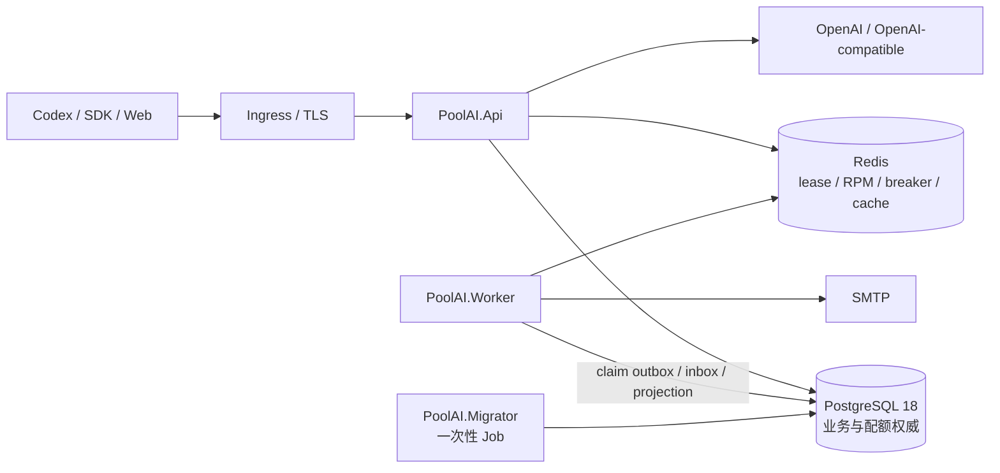
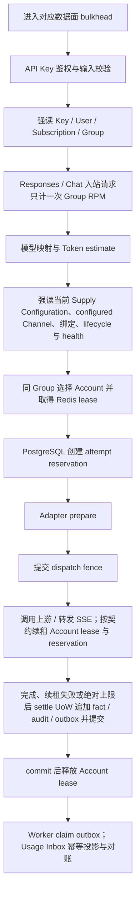
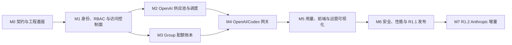

# PoolAI 系统重构方案 v1.0

> 状态：Release 1（R1.1 GA）重构实施基线  
> 目标技术栈：.NET 10 / ASP.NET Core 10 / EF Core 10 / Npgsql 10 / PostgreSQL 18 / Redis / Vue 3  
> 最后更新：2026-07-18
> 实施策略：绿地重建；不是 Go 源码逐文件翻译，也不包含旧库在线迁移

## 0. 文档定位与权威边界

本文是面向交付的 PoolAI 系统重构方案。它回答五个问题：重构什么、重构成什么、按什么边界实施、如何分阶段交付、用什么证据判断完成。

本文不重复也不重新编号字段级契约。唯一有效的契约顺序见 [`README.md`](README.md)；本方案不得产生另一套优先级。任务查阅入口如下：

- HTTP/SSE 使用 [`contracts/openapi-v1.yaml`](contracts/openapi-v1.yaml)、[`contracts/error-catalog.md`](contracts/error-catalog.md) 和 [`contracts/fixtures/`](contracts/fixtures/)；
- 数据库使用 [`database/README.md`](database/README.md) 及该目录 SQL；
- 运行时协调使用 [`runtime/redis-contract.md`](runtime/redis-contract.md)；
- 架构与 Design Pattern 使用 [`architecture/design-pattern-baseline.md`](architecture/design-pattern-baseline.md)；
- 范围、RBAC、配置、SLO、Backlog 和 DoD 使用 [`开发执行规格-v1.0.md`](开发执行规格-v1.0.md)；
- 仓库布局使用 [`architecture/repository-structure.md`](architecture/repository-structure.md)。

本文只负责目标态、能力取舍、工作流、交付顺序、切换策略和验收追踪。

任何实现都不得引用本文的概括去覆盖更高优先级契约。需要改变冻结行为时，先建立 ADR，再在同一变更中同步契约、测试和本方案。

### 0.1 目标状态与当前状态必须分开

| 状态 | 含义 | 当前结论 |
|---|---|---|
| PoolAI 目标状态 | 本方案及高优先级契约定义的 .NET 10 系统 | 设计基线已冻结，业务实现和生产验收仍待完成 |
| PoolAI 当前仓库状态 | 工作区内已经存在且可验证的资产 | 以 [`project-memory/current-state.md`](project-memory/current-state.md) 的证据、未闭合门禁和当前里程碑为准；本文不复制易漂移的 PR、测试计数或阶段进度，也不以开发候选代替里程碑或 Release 1 验收 |

Sub2API 仅是本方案形成前的能力参考，不是实现依赖、兼容目标或完成度证据；后续上游变化不会自动改变本方案。

### 0.2 版本名称

本方案沿用执行规格中的定义：R1.0 是内部工程与领域基础里程碑；“Release 1 完成”指 R1.1 通过全部 GA 发布门。R1.2 的 Anthropic 增量不阻塞 R1.1。

---

## 1. 重构使命与成功标准

### 1.1 重构使命

PoolAI 要从上游的大型、多平台、含商业能力的订阅分发系统中，提取一个非商业的统一 AI 网关：

> 管理员手工授予订阅访问；用户持绑定 Group 的 API Key 调用 OpenAI/Codex 兼容接口；所有用户共同消耗 Group Token 池；系统按真实上游 Account 和 attempt 记录 Token；用户只能查询 Group 总体池用量，管理端可按权限下钻运营事实。

本次重构的本质是领域收敛和架构重建，而不是语言替换。目标系统不继承上游 Go 包结构、Ent 模型、Wire 依赖注入、旧表结构或商业领域概念。

### 1.2 业务闭环

```text
管理员先创建 Group 与 Group 总量，再以独立 Supply Configuration 配置 Channel、Account 和绑定
  → 创建用户、无价格订阅模板并手工授予 Subscription
  → 用户登录并创建固定绑定该 Group 的 API Key
  → Codex/SDK 通过统一入口调用模型
  → 系统强校验 Key、User、Subscription、Group 与供应状态
  → 在同 Group 内选择 Account、取得 lease 并预留 Token
  → 调用上游，按 Account/attempt 记录并核销 Group
  → 用户查询 Group 池总体用量，管理端按 Account/attempt 下钻
```

### 1.3 成功标准

| 维度 | 成功条件 | 主要证据 |
|---|---|---|
| 产品收敛 | 只存在订阅访问、Group 共享 Token 池和 Account 用量统计；商业能力与个人配额不存在 | 公开 API、Schema、菜单、配置和 forbidden-scope 扫描 |
| 协议可用 | Codex/SDK 可使用 Responses、Chat Completions、Models 和 Usage；流式、非流式和错误语义稳定 | Contract、fixture 与 E2E 测试 |
| 配额正确 | 并发请求不超发；dispatch 前后失败有确定核销结果；迟到用量可追加纠正 | PostgreSQL 并发、故障注入与对账测试 |
| 统计可信 | 每次真实上游 attempt 归属真实 Account；Group 累计可与结算事实对账 | Integration Event、投影重建和 reconciliation 报告 |
| 架构受控 | 模块边界、写所有权、Host Composition Root 和依赖方向不能被代码绕过 | Architecture Test 与数据库角色测试 |
| 安全可恢复 | 凭据不以明文持久化或泄漏；身份撤销及时；迁移、备份、恢复和密钥轮换可演练 | 安全测试、恢复演练、runbook 证据 |
| 可运营 | 关键路径可由 request → attempt → reservation → Account 追踪，SLO 和故障隔离通过认证 | 日志、指标、Trace、告警、负载与故障报告 |

数字化 SLO、数据规模和容量阈值不在本文重复，统一执行 [`开发执行规格-v1.0.md`](开发执行规格-v1.0.md) 第 8 节。

---

## 2. 范围重构与能力处置

### 2.1 业务参与者与 RBAC

业务参与者和权限角色不是同一概念。API 客户端代表某个 User 的 API Key；OpenAI-compatible 上游和 SMTP 是外部系统。服务端 RBAC 固定为：

| 角色 | 重构后职责 |
|---|---|
| Admin | 平台安全、用户、供应、订阅、Group 总量、周期重置、审计和运维；只有 Admin 可调整 Group 总量或重置周期 |
| Operator | 用户查询、Channel/Account、订阅、用量和健康的日常运营；不能调整或重置 Group 总量 |
| Auditor | 全平台状态、审计和报表只读 |
| User | 本人安全、API Key、订阅状态和可访问 Group 的总体池用量 |

精确操作级授权以执行规格第 3 节为准，前端隐藏菜单不能代替服务端 Policy。

### 2.2 能力处置矩阵

| 处置 | 能力 | 重构动作 |
|---|---|---|
| 保留并收敛 | 封闭开户、密码/TOTP、Session、API Key、手工 Subscription | 去除价格、购买和个人额度语义；按冻结状态机重建 |
| 保留并收敛 | Group、独立 Group Supply Configuration、Channel、Account、模型映射、健康、Account lease、同 Group failover | Account/Channel 显式 `provider=openai/openai_compatible`；公开 `platform=openai` 只表示入站协议族；禁止跨 Group 切换 |
| 全量重建 | Group Token 配额 | Group 成为唯一累计配额主体；PostgreSQL 原子预留、核销、释放、回收、调整和重置 |
| 全量重建 | Account Token 统计和 Group 池查询 | 逐 attempt 不可变事实；Usage 只做可重建投影；用户查询 Group 总体池 |
| 全量重建 | 后端工程结构 | 改为 .NET 10 模块化单体、多 Host、Clean/Hexagonal、显式 Composition Root |
| 保留前端技术路线 | Vue 3 管理端与用户端 | 按目标旅程和安全边界重建，不迁移商业页面 |
| R1.2 延后 | Anthropic Messages 与 count_tokens | R1.1 验收后复用同一 Gateway/Quota pipeline 增量接入 |
| R2+ 延后 | Gemini、Grok、Antigravity、Bedrock、媒体、批任务、WebSocket、上游 OAuth | R1.1 不注册路由、适配器、菜单或未完成开关 |
| 永久删除 | 计费、定价、账单、余额、充值、提现、订单、支付、退款、发票、收入、成本、利润 | 不创建 Module、表、API、配置、指标、菜单或占位类型 |
| 永久删除 | 付费套餐、单价、倍率、金额窗口、余额冻结、可购买配额 | Subscription Template 仅表达无价格的访问模板 |
| 永久删除 | 兑换码、优惠码、邀请码奖励、推广、返利、分销、佣金 | 不迁移、不兼容、不预留 |
| 永久删除 | User、API Key、Subscription、Account 或平台级累计配额 | 只统计 Account Token，不给 Account 或用户设置可消费总量 |

以下是容量或安全控制，不属于商业计费，不能误删：Group 累计 Token 总量、Group RPM、Account 并发 lease、请求体限制、上游限流、供应商原生 quota/429 状态、健康检查、熔断和 Token 事实。

### 2.3 R1.1 公开能力

R1.1 只形成一个可生产验收的 OpenAI/Codex 垂直切片：

- `POST /v1/responses`：流式与非流式；
- `POST /v1/chat/completions`：流式与非流式；
- `GET /v1/models`：只返回当前 Key/Group 可用模型；
- `GET /v1/usage`：返回当前 Key 所属 Group 的总体池用量；Codex 等工具使用同一入口，不建立 Codex 专属用量路由；
- 身份、API Key、Subscription、Group、供应池、用量、审计和必要运维控制面；
- 用户端、`/key-usage`、管理端和只读运行设置摘要。

精确路由、请求和响应形状只由 OpenAPI 定义。

---

## 3. 目标领域规则

### 3.1 Subscription、API Key 与 Group

1. Subscription 只回答“用户在某个时间点能否进入 Group”，不保存价格、余额、个人配额或个人用量。
2. 每个 `(user_id, group_id)` 只有一条 canonical Subscription；分配、延长、暂停、恢复和撤销更新同一资源并追加审计。
3. Subscription 持久状态只有 `active/suspended/revoked`；`scheduled/expired` 由 PostgreSQL 时钟即时派生，不由 Worker 写回。
4. 订阅续期不重置 Group 配额。
5. API Key 创建时固定绑定一个 Group；绑定不可修改，换组只能新建 Key 并撤销旧 Key。
6. 每个新模型请求和每个 failover attempt 都要重新强读 canonical Key、User、Subscription、Group 与 Supply 状态。
7. 当前已准入 attempt 可完成并结算；后续 attempt 不能沿用旧授权快照。
8. R1.1 只允许同 Group failover，始终满足 `routing_group_id = quota_group_id`。
9. 每个 JWT 控制面请求都必须强读 PostgreSQL 中的 User status、role 和 `token_version`；用户状态或角色变更与 `token_version` 递增同事务提交，数据库不可用时授权 fail-closed 并统一返回 `503 dependency_unavailable`。

### 3.2 Group 是唯一累计配额主体

每个 Group 的当前周期只使用以下池语义：

```text
remaining = max(total - consumed - reserved, 0)
overage   = max(consumed - total, 0)

准入条件：consumed + reserved + estimate <= total
```

| 值 | 含义 |
|---|---|
| `total` | Admin 配置的有限 Group Token 总量 |
| `consumed` | 已完成结算的所有 attempt 累计值 |
| `reserved` | 在途 attempt 的临时占用，不是用户或 Account 配额 |
| `remaining` | 当前可供新 reservation 使用的剩余 Token 容量 |
| `overage` | 实际核销超过 total 的可观察值，不产生应收、欠费或付款语义 |

不支持 unlimited。管理输入的 `total` 和单 attempt `estimate` 为 JavaScript 安全整数范围；累计事实用 PostgreSQL `numeric(78,0)` 和 .NET `BigInteger`，公开累计输出使用十进制字符串。精确边界由数据库和 OpenAPI 契约负责。

配额准入失败必须区分永久耗尽、单次 estimate 无法容纳和仅受在途 reservation 影响三类情况；稳定错误码与 `Retry-After` 以错误目录为准。`reserved-full` 只是不持久化、不公开的内部派生标签；当 `consumed < total <= consumed + reserved` 时公开 quota status 仍为 `active`，公开状态始终只有 `active/exhausted/disabled`。

只有 Admin 能手工调整 total 或创建新 period 完成 reset。降低 total 不改写 consumed；既有 reservation 仍按事实结算，必要时形成 overage。PostgreSQL 是累计配额唯一权威，任何 Redis 或内存快照都不能决定准入。

### 3.3 Account Token 事实与 Usage 投影

1. 每次真实上游调用生成独立 attempt；failover 前后的调用分别归属各自 Account。
2. 上游 usage 是优先证据；无可靠值时允许保守估算，但必须记录来源和估算标记。
3. 已创建的结算事实不可覆盖；迟到真实值通过 append-only adjustment 修正。
4. Account 是内部归属和管理报表维度，不拥有累计配额。
5. GroupQuota 独占写入 request、attempt、adjustment 和配额结算事实；Usage 通过版本化事件构建可重建投影。
6. 请求数按 `request_id` 去重；attempt 数、failover、错误和 Token 按真实 attempt 聚合。
7. 一个 Account 服务多个 Group 时，所有统计必须按事实中的 `quota_group_id` 隔离，不能按当前绑定关系反推历史。

### 3.4 Group 池用量查询

`GET /v1/usage` 是订阅用户和 Codex 工具看到的池视图：

- Group 由当前 API Key 在服务端确定，不接受客户端传入 Group ID；
- 汇总该 Group 内所有用户、Key 和 Account attempt 对共享池造成的总体消耗；
- 返回 quota、请求和 Token 聚合，不返回 Account、用户、Key 或个人贡献排名；
- quota 耗尽时模型请求被拒绝，但有效 Key 仍可查询用量；
- quota 当前值来自强一致快照，today/7d/30d/period 趋势允许明确、可观察的投影延迟；
- 查询不占用 Group RPM、不创建 reservation，也不从趋势反算 quota；
- `access` 只描述当前调用者的访问资格，不改变池聚合口径。

用户端必须明确展示“这是整个 Group 的共享池，不是个人用量”。管理端才可按 RBAC 查看 Account、模型、时间和 attempt 下钻。

---

## 4. 目标架构

### 4.1 部署拓扑



- Api、Worker、Migrator 是独立进程和独立 Composition Root，互不引用可执行项目。
- Api 不加载 Worker loop，不执行 DDL；Worker 不暴露公开 Endpoint，不执行 DDL；Migrator 不加载 Gateway、Redis 或后台循环。
- 系统采用模块化单体，不在 R1.1 拆分微服务或独立模块数据库。

### 4.2 Bounded Context 与写所有权

| Context | 责任 | 独占写入 |
|---|---|---|
| Identity | User、Role、密码/TOTP、Session、Refresh family、API Key、一次性 Token | 身份与安全状态、API Key HMAC、email outbox |
| SubscriptionAccess | 无价格 Template、canonical Subscription、effective access | Template 和 Subscription |
| GroupQuota | Group lifecycle/version、opaque activation evidence、Period、Reservation、dispatch、核销、纠错和不可变结算事实 | Group、activation token/observed_at、quota、reservation、event、usage request/attempt/adjustment；不含 Channel/binding |
| Supply | Group Supply Configuration、Channel、Account、credential envelope、模型映射、Group–Account binding、持久健康 | `group_supply_configurations`、其 `group_accounts` 子项及其他供应事实；不写 Group/version |
| Routing | 同 Group 过滤、评分、粘性、Account lease、RPM 与 breaker 协调 | Redis 运行时协调状态，不写累计配额 |
| Gateway | 协议无关 request/attempt pipeline、流生命周期、failover | 不直接拥有业务表，通过模块端口提交命令 |
| Usage | Group/Account 查询、小时聚合、对账与新鲜度 | 可重建投影和 watermark |
| Operations | Audit、通用 command idempotency、outbox/inbox、诊断与投递状态 | 幂等响应记录、append-only audit 和消息投递元数据 |

跨 Context 只通过 `*.Abstractions`、不可变 Snapshot、强类型 ID、版本化 Integration Event 或已登记的窄数据库 guard 协作。`group_supply_configurations.group_id -> groups.id` 只是存在性 FK，不转移写 owner；Group 与 Supply Configuration 使用独立强 ETag/Idempotency scope。不得共享 Entity、DbContext、Repository、`IQueryable`、可变领域对象或跨资源 `If-Match`。

Account/Channel 退役只依赖 Supply 自有引用，不查询 Group status：任一 enabled binding 阻止 Account 退役并返回 `account_in_use`；任一 non-null Supply Configuration 的 Channel 引用阻止 Channel 退役并返回 `channel_in_use`。管理员必须先 PATCH 清理/禁用这些引用再退役，不能为判断 active/disabled/archived Group 增加跨 Context 读取。

`PoolAI.Application.Orchestration` 不是新的 Bounded Context。它只组合跨模块控制面用例，不拥有表、Entity、Repository、DbContext、Endpoint 或跨模块事务。Operations 通过加入调用方当前 PostgreSQL UoW 的 appender/store 提供 idempotency、audit 和 outbox/inbox 物理基础设施；它和调用模块都不得为同一业务命令另开事务或自行提前 commit。

### 4.3 Design Pattern 落点

| Pattern | 目标落点 | 防止的退化 |
|---|---|---|
| DDD + Bounded Context | 八个业务 Context 和唯一表写 owner | God service、共享业务模型、跨模块直接写表 |
| Clean / Hexagonal | Domain/Application 向内，EF/Redis/HTTP/SMTP 为 Adapter | 框架类型侵入领域、Endpoint 直连数据库 |
| CQRS | 写模型维护不变量；Usage/列表使用专用读模型 | 用最终一致聚合决定授权或 quota 准入 |
| Repository + UoW | 每个 Command 至多一个本地 PostgreSQL 事务 | Generic Repository、跨模块事务、外部 I/O 持锁 |
| Process Manager | Gateway 显式推进 request 和逐 attempt 生命周期 | 巨型 Endpoint、递归 retry、隐式补偿 |
| State | Subscription、资源、Reservation、attempt phase、breaker | 相互矛盾的 boolean 和非法状态跳转 |
| Strategy | Account 评分、Token estimate、retry/failover eligibility | 策略自行读库、改 quota 或重复重试 |
| Adapter / ACL | OpenAI 请求、响应、SSE、usage 与错误规范化 | 厂商 DTO/SDK 泄漏进业务模块 |
| Decorator | 观测、超时、Header 清洗等横切能力 | 横切层吞错、重复核销或改变业务顺序 |
| Factory / Registry | 按协议、上游类型和操作选择唯一 Adapter capability | Service Locator、反射插件和运行时歧义 |
| Bulkhead | 非流、SSE、控制面、Usage 四个独立有界入口 | 无界队列和一个慢流拖垮全部请求 |
| Circuit Breaker | Account 级 Redis 共享 breaker 与单 probe | 每实例独立风暴、认证错误自动探测 |
| Transactional Outbox/Inbox | 结算、audit、事件同事务；消费幂等 | “扣了不记”、双写窗口和重复投影 |

完整依赖矩阵和例外只在 Design Pattern 基线维护，Architecture Test 必须把它变成可执行约束。

### 4.4 数据面和控制面隔离

- 数据面：模型入口、鉴权、调度、Account lease、Group reservation、上游调用、流转发、结算和同 Group failover。
- 控制面：身份、API Key、Subscription、Group、供应配置、总量调整、手工 reset、用量查询、审计和诊断。
- 两者共享模块能力和 PostgreSQL 权威域，但使用独立 bulkhead、超时、授权策略和观测指标。

---

## 5. 重构工作流

| ID | 工作流 | 主要交付物 | 前置依赖 | 退出证据 |
|---|---|---|---|---|
| WS-01 | 契约与工程基座 | 锁定 SDK/包、Solution、项目 DAG、Host、构建、CI、合同校验、Architecture Test | 冻结文档 | 干净环境 restore/build/test；依赖违规可被阻断 |
| WS-02 | 数据与运行时基座 | Migrator、空库 baseline、运行时角色、Redis 连接/时间/脚本登记与测试框架、Testcontainers、mock upstream/SMTP | WS-01 | 空库迁移、checksum、角色权限和 Redis 基础测试框架通过；不在 M0 实现业务 Lua |
| WS-03 | Identity 与 SubscriptionAccess | bootstrap、登录/TOTP、Redis 登录失败限流、Session、重置密码、RBAC、API Key、Template、canonical Subscription | WS-01/02 | 身份撤销、并发 refresh、登录限流 fail-closed/防枚举、Key 仅限首次成功/绑定幂等重放回显、订阅状态机和审计通过 |
| WS-04 | Supply 与 Routing | envelope secret、显式 Provider、独立 Group Supply Configuration/ETag、Channel/Account、模型映射、绑定、`IGroupSupplyReadiness` opaque evidence、Group 激活编排、健康、versioned Account lease acquire/renew/release、RPM/breaker Lua 与同 Group 调度 | WS-01/02/03 Policy | Group/Supply 写 owner与双 ETag、activation evidence/race、多实例协调、长请求 lease 生命周期、完整 Redis 故障矩阵、URL/secret 安全和同 Group 约束通过 |
| WS-05 | GroupQuota | period、total 调整、reset、reserve/renew、绝对生命周期上限、dispatch fence、settle/release/expire/adjust、sweeper、断连 drain 和对账 | WS-02/03 Group | 并发无超发；长请求续租/上限/回收和 kill-point 故障结果确定；事实与 quota 可对账 |
| WS-06 | Gateway 与 OpenAI Adapter | Process Manager、Responses、Chat、Models、SSE、取消、错误规范化、failover | WS-03/04/05 | 协议 fixture、phase 矩阵、半流/断流/取消/故障切换通过 |
| WS-07 | Usage 与前端 | 投影、重建、`/v1/usage`、用户池视图、`/key-usage`、管理端 Account 下钻 | WS-03/05/06 | 隐私、新鲜度、六态 UI、无密钥持久化和大数据聚合通过 |
| WS-08 | 安全、性能与运营 | OTel、审计、告警、备份恢复、密钥轮换、SBOM、签名、负载/故障认证 | 全部 | SLO、安全门、恢复演练和 R1.1 发布证据通过 |

### 5.1 工作流执行规则

1. 每个工作流先补齐或确认契约和失败语义，再写实现；不能以实现反向生成需求。
2. 每个业务写操作映射为显式 Command/Handler；每个查询返回专用 DTO；Endpoint 不持有业务状态机。
3. 一个 Command 只有一个本地 PostgreSQL UoW。HTTP、Redis、SMTP、退避和流 I/O 不得处在该事务中。
4. 每个 Story 必须声明所属 Context、表写 owner、公开端口、幂等/并发策略、审计点、测试层级和故障行为。
5. 新模块、跨 Context 数据访问、Host、协议、状态或商业概念必须先经过 ADR/范围审查。

---

## 6. 关键端到端流程

### 6.1 环境引导和管理配置

1. 平台预置数据库 owner/runtime 角色和 Secret Provider，不把凭据写入仓库。
2. Migrator 独占迁移锁，从空库应用不可变 SQL baseline、权限和版本 manifest。
3. 一次性 bootstrap 命令创建首个 Admin；重复执行不会创建第二个初始管理员或泄漏秘密。
4. Admin 先在 GroupQuota 的一个 UoW 中创建不含 Channel/binding 的 disabled Group，并初始化有限 total 和唯一 current quota period；没有 current period 的 Group 不得激活。
5. Admin 以独立 Supply Configuration 资源和独立 ETag 创建/修改 configured Channel 与 bindings；Account/Channel 创建时显式选择不可变 `provider=openai/openai_compatible`。激活 Endpoint 必须调用 `GroupActivationOrchestrator`，由它分别强读 GroupQuota 与 `IGroupSupplyReadiness`，取得 opaque versioned token/数据库 observed_at 后调用 GroupQuota activation command。GroupQuota 在自己的 UoW 中原子提交 Group 状态、evidence、幂等响应、审计和 outbox；Orchestrator 无数据所有权和共享事务，Endpoint 不得绕过。数据库 activation guard 只读当前 Supply readiness 防止直接非法激活。
6. Admin 创建用户和无价格 Subscription Template，向用户授予 canonical Subscription。
7. User 登录后只读取本人获授 Subscription 及其 `plan_name` 快照，不浏览独立 Template 目录或自助申请；再从有效订阅选择 Group 创建 API Key。一个命令只生成一份逻辑凭据，完整 Key 只在首次成功响应及同一绑定幂等请求的安全重放中显示，后续读取不回显。

### 6.2 模型请求 Process Manager



硬性规则：

- 在任何上游字节发出前，必须先持久化并提交 `dispatch=started` fence。
- Group RPM 只对通过鉴权的 Responses/Chat 模型 POST 按入站 request 计数一次；failover 不重复计数，Models 和 Usage 不进入 RPM。
- 按 [`ADR 0006`](architecture/adr/0006-register-group-subscription-lifecycle-fence.md)，跨 Context 数据库 `SELECT`/行锁候选 registry 只含三个 family：**Family A** 是 `poolai_quota_reserve` 的 canonical admission 与既有结算路径的 route/provider identity 验证；**Family B** 是 `poolai_validate_group_activation` 的点时 activation guard；**Family C** 是 Group–Subscription lifecycle fence。精确函数、表、字段、锁序和等待后数据库时钟规则只在架构与数据库契约维护；三类均不授权跨 Context 写入、共享 UoW 或通用 SQL executor。旧 activation evidence 或 Redis snapshot 也不能代替 Family A 的强读。
- ADR 0006 治理状态：**Accepted**（[Issue #44 永久批准评论](https://github.com/Lyon1984/PoolAI/issues/44#issuecomment-5011030600)）。
- 只有 `not_started` reservation 可以零消耗 release/expire；dispatch 后的歧义结果按 estimate 保守核销，后得真实值用 adjustment 修正。
- 上游调用存活期间，Routing 按 Redis contract 续租 Account lease，GroupQuota 按数据库 contract 续租 reservation；两者时钟、间隔和所有权不能混用。续租不能突破流/非流绝对生命周期上限；任一硬 lease 续租失败或到达上限都要取消上游，最多执行契约规定的 15 秒 drain，再用已知 usage 或保守 estimate 结算，最后释放 Account lease。
- failover 必须同时满足 phase、总 deadline、attempt/retry budget 和 Adapter capability 的许可。只有可审计地证明上游未执行，或存在契约明确的安全幂等重放证据时，才可在下游 Header/业务输出提交前建立新 attempt；401/403/429、5xx、首包超时或“尚未输出”本身都不是许可。R1.1 模型 POST 不提供通用响应重放。切换前必须先结算旧 attempt，再为新 attempt 重做 canonical 强读、同 Group 路由、lease 和 reservation。
- Adapter、timeout、breaker 只能返回强类型 outcome，不能自行重试、切换 Account 或修改 quota。
- transport cancellation 不得中止必须完成的有界 settle/drain。

精确 phase、deadline、lease、重试预算和错误映射以执行规格、数据库和错误契约为准。

### 6.3 Group 池用量查询

1. 使用当前 Key 完成鉴权并在服务端确定唯一 Group。
2. 校验当前 Key/User/Subscription/Group，但 quota exhausted 不阻断查询。
3. 从 GroupQuota 取得强一致 total/consumed/reserved/remaining/overage 和当前 period。
4. 从 Usage 取得 today/7d/30d/period 趋势、请求数和投影新鲜度。
5. 组合为一个隐私安全响应；不接受 group 参数，不返回 Account/User/Key 维度。
6. `/key-usage` 只在内存中短暂持有 Key，并通过同源 Authorization Header 调用；禁止 URL、浏览器持久化、分析和错误上报。

### 6.4 迟到用量与对账

1. 初次 settle 把 reservation、quota counter、不可变 attempt fact、audit 和 outbox 放在同一事务提交。
2. 无可靠 usage 的 dispatched attempt 先保守核销并标记证据。
3. 后得真实 usage 时追加 adjustment，原事实不 UPDATE/DELETE。
4. Usage 按 `attempt_id` 幂等重算投影；重复和乱序事件不改变最终结果。
5. 对账任务比较 quota 事实与 Usage 投影；差异触发告警和人工处置，不静默改账。

---

## 7. 数据、Redis、秘密与迁移策略

### 7.1 权威域分工

| 能力 | 权威来源 | 故障策略 |
|---|---|---|
| User/Role/Key/Subscription/Group/Supply canonical 状态 | PostgreSQL | 不可用时公开路径统一 `503 dependency_unavailable`，模型准入 fail-closed |
| Group quota、period、reservation、dispatch、settlement | PostgreSQL | 不可用时统一 `503 dependency_unavailable`，不按缓存/evidence 放行 |
| Account lease、Group RPM、共享 breaker probe | Redis `TIME` + versioned Lua | 硬协调不可用时 fail-closed |
| 登录失败限流 | Redis `TIME` + versioned Lua | 登录请求 fail-closed；存在/不存在用户保持同一响应与不可区分时延策略 |
| 粘性和可回源缓存 | Redis | 按运行时契约降级或回源 |
| Account/Group 趋势 | Usage PostgreSQL 投影 | 允许显式 stale；不得参与 quota 准入 |

### 7.2 数据库落地

- R1.1 从空 PostgreSQL 数据库部署；`PoolAI.Migrator` 是唯一 DDL owner。
- SQL baseline、数据库函数和运行时权限是执行真相；EF 映射必须与之校验，不能反向改写已签收 migration。
- 已执行 migration 和 checksum 永不修改，修正只能前向新增。
- `usage_attempts` 和 adjustment 是 GroupQuota-owned append-only 事实；Usage 只有投影写权限。
- Api、Worker 使用不同最小权限角色；Architecture Test 之外还要用真实数据库角色证明越权写入失败。
- Token 累计、并发 reservation、重置、dispatch fence 和 late adjustment 必须在真实 PostgreSQL 上做集成与故障测试，不能只依赖内存替身。

### 7.3 Redis 落地

- 只有运行时契约登记的 key 和 Lua 可以用于硬协调；业务模块不得直接拼 key 或复制脚本。
- 累计 quota 永远不进 Redis 准入路径。
- Account lease/RPM 失败关闭；缓存可按契约回源；恢复后要验证无幽灵 lease、无负计数和无跨 Group 泄漏。
- 登录失败限流异常时登录请求 fail-closed；计数、错误和时延不能泄露用户是否存在。
- Worker 不使用 Redis leader lease；单 owner 以 PostgreSQL session advisory lock 为准。

### 7.4 秘密与身份材料

- API Key 只保存 HMAC-SHA256 digest、prefix 和 pepper version；一个创建/轮换命令只生成一份逻辑凭据，完整值只在首次成功响应及同一绑定幂等请求的安全重放中返回，后续读取不回显。
- Account 凭据使用版本化 AEAD envelope，AAD 绑定用途、实体和字段；未知版本或认证失败必须 fail-closed。
- 密钥轮换、重包裹、备份恢复和旧 keyring 退出都必须有演练证据。
- 日志、Trace、错误、备份、前端状态和测试 fixture 不得包含密码、TOTP seed、Refresh Token、API Key 或 Account 明文凭据。

### 7.5 绿地数据边界

R1.1 只验证空库部署、初始配置和新系统产生的数据。旧系统数据迁移、Go/.NET 双写、旧表影子读、按 Group 在线切流和历史商业数据退役均不在本方案范围；当前不为它们设计流程、对象或任务。

---

## 8. 分阶段交付与依赖

本节只给出重构路线；可导入任务系统的 Epic、验收场景和精确门禁以执行规格第 10–13 节为准。



| 阶段 | 重构成果 | 进入条件 | 退出条件 |
|---|---|---|---|
| M0 | 锁定工程版本；建立 Solution、Host、模块 DAG、契约校验、空库迁移、Redis 连接/脚本登记/测试基座和 CI | 高优先级契约已评审；SDK/pnpm 版本已选定 | 干净环境一键 restore/build/test；架构、合同、migration、Redis 基础测试框架和本地拓扑通过 |
| M1 | Identity、RBAC、Redis 登录限流、API Key、GroupQuota-owned Group 基础（DTO/Command 不含 Channel/binding）、Template、canonical Subscription | M0 绿色 | 身份/会话/撤销/登录限流 fail-closed 与防枚举/订阅状态机/Group ETag/审计/RBAC 自动化通过；无 Supply Configuration 写路径 |
| M2 | secret envelope、显式 Provider、独立 Group Supply Configuration/ETag、Channel/Account、映射、绑定、opaque activation evidence/编排、健康、Account lease acquire/renew/release、RPM、breaker 和同 Group 调度 | M1 Policy 和 Group 基础可用 | 双 ETag/幂等隔离、Orchestration/写 owner、evidence/race、供应安全、逐 attempt canonical recheck、长请求 lease、多实例协调、完整 Redis 故障矩阵和同 Group 约束通过 |
| M3 | Group period、total、reservation reserve/renew/上限/回收、dispatch、settle、adjustment、outbox 和对账 | M0 数据基座、M1 Group 可用 | 并发、BigInteger、长请求续租/取消/drain、故障点、不可变事实和对账测试通过 |
| M4 | Responses、Chat、Models、SSE、Gateway Process Manager 和 failover | M1/M2/M3 退出 | OpenAI/Codex 垂直切片的合同、E2E、流、取消和故障矩阵通过 |
| M5 | Usage 聚合、`/v1/usage`、用户/管理前端、`/key-usage` 和运营面板 | M3/M4 真实事实可用 | 投影重建、隐私、浏览器安全、可访问性和六态 UI 通过 |
| M6 | 威胁收敛、容量认证、部署、备份恢复、runbook、SBOM 和发布证据 | M0–M5 全绿 | 执行规格全部 GA 质量门通过，才可标记 Release 1 完成 |
| M7 | Anthropic R1.2 契约、Adapter、计量与 UI 增量 | R1.1 已 GA | R1.1 全量回归和 Anthropic 独立发布门通过 |

### 8.1 并行策略

- M2 和 M3 在 M1 提供稳定 Group/Policy 后可并行，但不得分别复制 canonical access 或 Group 模型。
- M5 的前端壳、设计系统和六态组件可从 M1 并行；真实 API 集成必须等待对应契约和后端能力。
- Contract、Architecture、Integration 和安全测试不是收尾任务，随所属工作包一起提交。
- M7 不得以 feature flag 形式提前把未完成公开路由带入 R1.1。

### 8.2 阶段停线条件

出现以下情况时停止向下一里程碑推进：

- 高优先级契约互相矛盾且没有 ADR；
- 新实现引入商业、兑换码或个人累计配额概念；
- quota 并发或 dispatch 故障不能证明无超发、无“扣了不记/记了不扣”；
- 模块或数据库权限允许绕过唯一写 owner；
- secret 可能出现在日志、响应、浏览器持久化或备份明文中；
- 仅靠 mock 或单实例测试宣称生产可用。

---

## 9. 上线切换与回滚

### 9.1 发布前置条件

1. 同一候选镜像已经通过 Main、与生产同拓扑的 Staging、24 小时 soak、Release Candidate、AC-001–045、三轮负载、安全、RPO/RTO 和回滚评审。
2. Api、Worker、Migrator 镜像以 digest 晋级，生产不重新构建；SBOM、签名、配置版本、migration/schema/Redis contract manifest 和恢复证据已归档。
3. 回退目标 digest 已验证能读取当前 Schema；不兼容时必须把本次发布标记为只能 fix-forward，不能假设可以应用回滚。
4. 变更窗口内冻结非紧急配置和 Schema 变更，确认单实例 Migrator advisory lock、Ingress 分批能力、部署级停止新准入操作、值班渠道和数据库恢复负责人可用；不新增运行时 settings mutation API。

### 9.2 生产部署与分批放量

部署顺序固定为：

1. 外部流量保持关闭或停留在已验证 digest；单实例 Migrator 取得 advisory lock，校验历史 checksum，执行 forward migration 并写入 manifest。
2. migration 成功后才启动/滚动 Worker 和 Api。首次绿地上线按 Worker → Api；后续版本只有在事件和 Schema 兼容矩阵允许时才滚动，任何 readiness/manifest 不匹配立即停止。
3. 完成自动 smoke：登录、RBAC 否定、Responses/Chat 非流与 SSE、Models、Usage、quota reserve/settle、outbox/inbox、告警和审计。smoke 未全绿时流量保持为零。
4. 使用 API Key 稳定哈希分批，避免同一调用者在版本间跳动：内部 allowlist 15 分钟 → 10% 15 分钟 → 25% 15 分钟 → 50% 30 分钟 → 100%。每批只能在观察窗完整且 go/no-go 门通过后推进。
5. 100% 后继续观察至少 60 分钟；观察结束前不结束发布窗口，不删除旧兼容镜像，也不执行破坏性清理。

每个观察窗同时满足以下门才是 go：

- quota safety、幂等和 Token 无损均为 100%，无 secret、跨 Group、重复核销或未定义契约事件；
- 平台错误率不高于 0.1%，非流/流式附加延迟与 `/v1/usage` 延迟达到执行规格 SLO；
- Usage lag `p99 ≤ 60 s`，reservation 回收 `p99 ≤ 60 s`，对账差异在 60 秒内回到 0 且没有持续 5 分钟非零；
- outbox/inbox/email 无不可解释增长，Worker 单 owner、breaker、DB pool、Redis、CPU/RSS 和 bulkhead 无告警；
- 自动 smoke 持续通过，错误预算和关键告警正常。

任一硬门失败立即 no-go：停止扩大流量并按下一节分类处置，不能用“总体平均正常”覆盖 quota、secret 或隔离失败。

### 9.3 停止、回退与事件处置矩阵

| 失败阶段或信号 | 立即动作 | 数据与版本处置 | 恢复条件 |
|---|---|---|---|
| Migrator 未运行或在提交前失败 | 保持候选流量为 0，停止部署 Api/Worker | 保留当前版本；修正 migration 后重跑 checksum/空库/升级测试 | Migrator 重跑成功且 manifest 一致 |
| migration 成功、尚未放量 | 不启动或下线候选 Api/Worker | Schema 向后兼容时可保持旧 digest；不兼容时只允许 fix-forward | readiness、smoke、兼容矩阵全绿 |
| 放量后应用/协议回归，Schema 向后兼容 | 立即冻结批次，把新请求切回旧 digest；候选实例停止新准入并 drain | 按 9.4 回退 Api/Worker；数据库不降级 | smoke、SLO、outbox/投影和对账重新通过 |
| Schema 不兼容或数据库数据损坏 | 停止所有业务写入；只在确认安全时保留只读 Usage/诊断 | 优先 fix-forward；只有数据丢失/损坏且事件负责人批准时按 RPO/RTO 执行 PITR/恢复 | 完整一致性、恢复演练检查和业务验收通过 |
| quota 不变量、重复核销或跨 Group 事实 | 全平台停止新模型准入和 quota 管理写；保留证据并 drain 当前 attempt | 不假设应用回滚可修复；运行受控对账，使用正式 adjustment 或恢复/fix-forward，绝不删账本事实 | quota/事实/对账全量验证为 0 差异并完成 P0 复盘 |
| secret 泄漏或身份撤销失效 | 隔离受影响入口/Account/User，停止相关流量并启动安全事件响应 | 撤销/轮换 JWT signing、pepper、KEK、API Key 或 Account credential 中受影响材料；限制证据访问，不删除审计证据 | 泄漏面收敛、轮换/重包裹和授权回归通过 |
| Redis/硬协调故障 | 模型请求维持 fail-closed；PostgreSQL 可用时 Usage 可继续 | 恢复/重建 Redis，不用 Redis 数据改 quota；验证 lease/RPM/breaker 状态 | 协调故障矩阵、幽灵 lease 和计数检查通过 |
| Worker/outbox/Usage 投影异常但 quota 正确 | 暂停受影响 consumer 和继续放量，保留 Api 准入与否由 SLO/积压门决定 | 不删除 outbox/inbox；修复后从 checkpoint 幂等重放或重建投影 | backlog 清空、lag 达标、reconciliation 为 0 |

### 9.4 Schema 兼容时的应用回退顺序

1. 冻结当前批次，Ingress 将所有新请求稳定路由到已验证旧 Api digest。
2. 候选 Api readiness 置为失败并停止新准入；活跃 SSE/attempt 进入有界 drain，超出 drain 预算的调用按取消与保守结算契约处理。
3. 保持与候选事件版本兼容的 Worker 单 owner 运行，直到候选 attempt、outbox 和必须的 settlement/adjustment 已可由兼容消费者接管；禁止两个不兼容 Worker generation 同时 claim。
4. 运行 reservation sweeper、outbox/inbox claim 和 Usage projector，确认没有永久 pending 或“已扣未记”。
5. 再把 Worker 回退到兼容旧 digest；最后移除候选 Api/Worker。任何步骤 manifest 不匹配都停止并 fix-forward。

应用回退只允许回到与当前 Schema、事件和 secret envelope 兼容的 digest。数据库 migration 前向演进，不用 Down migration 删除 quota、usage 或 audit 事实；Redis 可重建，但恢复期间 lease/RPM 继续 fail-closed。

### 9.5 回退或事件恢复后的验证清单

- [ ] 活跃 Api/Worker/Migrator digest、配置和 schema/Redis/event manifest 唯一且兼容；
- [ ] 每个受影响 Group 满足 quota 不变量，无负 reserved、重复 reservation 或跨 Group 事实；
- [ ] 每个 dispatched 终态 reservation 有唯一 settlement fact，未终态 reservation 仍有有效 lease 或进入受控回收；
- [ ] outbox 无丢失，inbox/checkpoint 可幂等推进，dead/replay 均有 owner/generation 和审计；
- [ ] Usage lag 达标，可从权威事实重建，reconciliation 在门槛内回到 0；
- [ ] API Key、Account credential、JWT/session 和 keyring 状态符合事件处置结果，无秘密进入日志/响应/前端；
- [ ] Responses、Chat、Models、Usage、SSE、RBAC、Group exhausted 查询和同 Group failover smoke 全绿；
- [ ] reservation、5xx、quota rejection、breaker、SSE、Worker backlog 和安全告警观察至少 60 分钟；
- [ ] 事件时间线、命令、证据、adjustment/恢复记录和最终 go/no-go 决定写入审计与 runbook 复盘。

---

## 10. 验证策略与发布门

### 10.1 测试层级

| 测试套件 | 必须证明的内容 |
|---|---|
| UnitTests | Aggregate/State/Strategy、授权、估算、错误分类、幂等和边界值 |
| ArchitectureTests | 项目 DAG、Clean 依赖、Context 写 owner、Host 白名单、禁用商业 namespace 和跨 Context 访问 |
| ContractTests | OpenAPI、ProblemDetails/OpenAI error、SSE/JSON fixture、Integration Event envelope 和兼容性 |
| IntegrationTests | PostgreSQL 原子性/锁/CAS/权限、Redis 登录/lease/RPM/breaker Lua、多实例、outbox/inbox、email、secret、投影重建；承载 Concurrency、Migration/DR 和基础 Fault 类别 |
| EndToEndTests | 四角色旅程、API Key、Subscription、Gateway、Usage、前端六态、隐私和浏览器密钥安全 |
| LoadTests | 非流、SSE、控制面、Usage 独立 bulkhead；quota 热点、breaker storm、投影吞吐和恢复 |

执行规格中的测试“类别”映射到上述六个物理项目，而不是新增或省略项目：Adapter fixture 分布在 ContractTests/IntegrationTests；E2E API 与 E2E Web 都进入 EndToEndTests；动态 Security 和跨进程 Fault 进入 IntegrationTests/EndToEndTests；SAST、依赖、镜像、secret scan 与 SBOM 属于 CI 门；Migration/DR 进入 IntegrationTests 并由发布流水线执行真实恢复演练。

### 10.2 必测故障点

- reservation 前、reservation commit 后、dispatch fence 前、fence commit 后、首个上游字节、下游 Header、首个业务事件、流中断和客户端断连；
- settle 事务提交前后、outbox 发布前后、消费者重复/乱序、Worker 崩溃接管和 adjustment 重放；
- Redis 不可用、Lua 超时、Account lease 丢失、breaker probe 竞争和缓存陈旧；
- 登录限流 Redis 故障、计数边界及存在/不存在用户的响应和时延防枚举；
- Account lease/reservation 续租失败、流/非流绝对上限、取消、15 秒 drain、sweeper 与迟到 usage；
- Subscription/API Key/Account/Group 在请求中途被暂停、撤销、禁用或退役；
- Token 的 2^53 输入边界、78 位累计边界、actual 大于 estimate、降低 total 和 reset 并发；
- PostgreSQL/Redis/节点时钟边界、TOTP 重放和 refresh family 并发。

### 10.3 R1.1 发布门

只有下列证据同时存在，才可宣告系统重构完成：

1. M0–M6 所有 Epic 和执行规格 AC-001–045 通过；
2. 六个测试套件、契约 lint、migration checksum、forbidden-scope 和依赖扫描全绿；
3. Critical/High 安全问题为零，其他风险有明确处置；
4. 三次容量认证、故障隔离、备份恢复和密钥轮换演练通过；
5. staging 可从空库部署，Api/Worker 无 DDL 权限，版本 manifest 匹配；
6. 产品、工程、测试、安全和运维证据归档；文档与当前实现状态同步。

### 10.4 契约追踪矩阵

任务系统必须保留下面的 WS、Milestone 和 Epic ID。每个 Story 再从对应行选择至少一个 DEC/AC、权威契约和自动化证据，形成 `WS → M/Epic → DEC/AC → 契约 → 测试/发布证据` 的闭环。

| WS | Milestone / Epic | 冻结决策与验收场景 | 权威资产 | 必须形成的证据 |
|---|---|---|---|---|
| WS-01 契约与工程基座 | M0-E1–E4 | DEC-001/002/027/034/037/038；AC-025/027/038/040 | [`README.md`](README.md)、[`repository-structure.md`](architecture/repository-structure.md)、[`design-pattern-baseline.md`](architecture/design-pattern-baseline.md)、[`contracts/`](contracts/) | restore/build、ArchitectureTests、ContractTests、forbidden-scope、不可变镜像与 SBOM |
| WS-02 数据与运行时基座 | M0-E3/E4 | DEC-014/026/032/038–040；AC-020/021/027/037/039–041 | [`database/README.md`](database/README.md) 与 SQL、[`redis-contract.md`](runtime/redis-contract.md) | 空库/重复/并发 migration、checksum、真实角色权限、Testcontainers、claim/崩溃接管、Redis 基础测试框架 |
| WS-03 Identity 与 SubscriptionAccess | M1-E1–E5 | DEC-003–008/018–020/026/028/031/033；AC-001–009/029/033–035/040 | [`openapi-v1.yaml`](contracts/openapi-v1.yaml)、[`error-catalog.md`](contracts/error-catalog.md)、执行规格第 3–4 节 | Unit/Contract/Integration/E2E；会话并发、Redis 登录限流/fail-closed/防枚举、撤权强读、Key 仅限首次成功/绑定幂等重放回显、email outbox 和审计 |
| WS-04 Supply 与 Routing | M2-E1–E4 | DEC-016/018/024/026/029/030/032/035/041/042；AC-005/015/016/020/021/029/032/037/042/044 | [`ADR 0001`](architecture/adr/0001-separate-group-quota-from-supply-configuration.md)、[`design-pattern-baseline.md`](architecture/design-pattern-baseline.md)、[`redis-contract.md`](runtime/redis-contract.md)、数据库权限、OpenAPI | Group/Supply 双 ETag与幂等、Group activation opaque evidence/race、Provider、secret/SSRF、逐 attempt Configuration 强读、versioned Lua、多实例 lease acquire/renew/release、RPM/breaker、同 Group 隔离和完整 Redis fault |
| WS-05 GroupQuota | M3-E1–E5 | DEC-009–017/022/026/036/038–040；AC-004/010–019/026/030/031/036/039–041/045 | [`database/README.md`](database/README.md) 与 quota SQL、[`error-catalog.md`](contracts/error-catalog.md)、架构事件契约 | 原子/并发/BigInteger、reservation renew/上限/取消/drain、dispatch kill points、append-only fact/adjustment、outbox/inbox、重放与 reconciliation |
| WS-06 Gateway 与 OpenAI Adapter | M4-E1–E5 | DEC-015–017/022–025/028/039/041；AC-012/015/016/020/021/028/029/039/042/043/045 | [`openapi-v1.yaml`](contracts/openapi-v1.yaml)、[`fixtures/`](contracts/fixtures/)、错误目录、Design Pattern/Redis 契约 | Adapter/Contract/E2E/Fault；phase、SSE 半包/断流/取消、RPM、safe retry/failover、bulkhead |
| WS-07 Usage 与前端 | M5-E1–E6 | DEC-009/021/025/027/034/040/041；AC-012/022–025/031/038/043/045 | OpenAPI、数据库 Usage 说明、执行规格第 6–8 节 | 投影幂等/重建/lag、大整数、privacy、`/key-usage` 浏览器无痕、六态/可访问性、Usage load |
| WS-08 安全、性能与运营 | M6-E1–E5 | DEC-002/027/032/034/037/041/042；AC-020/021/025/027/031/034/037–045 | 执行规格第 5/7/8/12 节、本方案第 9 节、所有受影响契约 | Threat model、SAST/DAST、三轮容量、24h soak、签名/SBOM、RPO/RTO、分批/回退演练、60 分钟发布观察 |

任务系统导入使用下面的唯一 primary WS；supporting WS 只拆分协作 Story，不改变 Epic owner。该表覆盖执行规格全部 38 个 M0–M7 Epic，并明确 M7 的预备归属。M7 仍只能在 R1.1 GA 后启动；M7-E1 的新公开协议在实现前必须先完成能力差异 ADR 和字段契约评审。

| Epic 范围 | Primary WS | Supporting WS |
|---|---|---|
| M0-E1–E2 | WS-01 | — |
| M0-E3–E4 | WS-02 | WS-01 |
| M1-E1–E5 | WS-03 | — |
| M2-E1–E4 | WS-04 | — |
| M3-E1–E4 | WS-05 | — |
| M3-E5 | WS-05 | WS-08 |
| M4-E1–E5 | WS-06 | — |
| M5-E1–E5 | WS-07 | — |
| M5-E6 | WS-07 | WS-08 |
| M6-E1–E5 | WS-08 | — |
| M7-E1 | WS-01 | — |
| M7-E2 | WS-06 | — |
| M7-E3 | WS-06 | WS-04/WS-05 |
| M7-E4 | WS-08 | WS-07 |

若 Story 无法填写上述任一列，说明它尚未达到可开发状态；不得用仅含自然语言的“完成标准”代替 DEC/AC 和可运行证据。

---

## 11. 主要风险与缓解

| 风险 | 影响 | 设计缓解 | 发布信号 |
|---|---|---|---|
| 分析文档与字段契约重复 | 实现分叉 | 本文只保留目标与不变量，字段链接权威资产 | 契约 diff/链接校验 |
| 把上游“已实现”误当 PoolAI 完成 | 虚假进度 | 当前状态独立维护，完成度只认代码与测试证据 | `project-memory/current-state.md` |
| quota 热点竞争或超发 | Group 池失真 | PostgreSQL 原子函数、短事务、固定锁序、压力测试 | 并发不变量与延迟 SLO |
| dispatch 后结果未知 | 少扣或重复扣 | fence、保守结算、append-only adjustment | kill-point fault 测试 |
| Usage 投影重复、乱序或延迟 | 用户看到错误趋势 | outbox/inbox、checkpoint、重建、lag 字段 | 重放一致性与 lag 告警 |
| Redis 故障绕过协调 | Account 过载或限流失效 | lease/RPM fail-closed，quota 始终在 PostgreSQL | 故障矩阵与告警 |
| 模块边界随开发侵蚀 | 隐式耦合、难以验证 | Abstractions、唯一写 owner、Architecture Test | CI 依赖与权限测试 |
| 上游流式协议差异 | SSE 破坏、错误泄漏 | Adapter/ACL、golden fixture、半流和取消测试 | Contract/E2E |
| secret 泄漏或不可恢复 | 安全事件或服务不可用 | HMAC、envelope、AAD、keyring、恢复演练 | secret scan/轮换/恢复证据 |
| 前端持久化 API Key | 用户凭据泄漏 | `/key-usage` no-store/CSP、内存态、遥测隔离 | 浏览器网络/storage 检查 |
| 商业功能回流 | 目标失焦 | 永久非目标 + forbidden-scope + ADR 门 | Solution/Schema/API/UI 扫描 |

---

## 12. 任务拆分与变更治理

### 12.1 开发任务模板

每个开发任务至少写明：

- 所属里程碑、工作流、Bounded Context 和用户价值；
- 输入/输出契约及链接，不复制可编辑 Schema；
- 允许读取和写入的数据 owner；
- Command/Query、UoW、幂等、并发、时钟和失败语义；
- 审计、日志、指标、Trace 和 secret 分类；
- Unit/Architecture/Contract/Integration/E2E/Load 中需要新增的证据；
- 明确非目标和回滚/兼容影响；
- 可独立验证的验收条件，不使用“基本完成”“支持正常场景”等模糊描述。

任务不能跨多个独立 UoW 或多个写 owner形成一个不可验收的巨型 Story；跨 Context 用例拆为公开端口、Orchestrator 和各模块命令，并分别测试。

### 12.2 ADR 触发条件

以下变化必须先建立 ADR：新增、合并或拆分 Context；改变表 owner；增加 Host；改变 Composition Root；跨 Context 事务或直读；读模型参与准入；新增公开协议；改变 quota 主体；允许跨 Group fallback；引入消息代理、微服务、Event Sourcing 或 Saga；以及任何商业或个人配额概念。

ADR 通过后，同一变更必须更新受影响的 OpenAPI、错误目录、SQL、Redis 契约、状态机、fixture、Architecture Test、执行规格和本方案。禁止只改代码或只改一份说明文档。

### 12.3 评审职责

| 评审面 | 必须确认的事项 |
|---|---|
| 产品/范围 | 用户价值、R1.1 边界、永久非目标、隐私口径 |
| 架构 | Context、端口、依赖、UoW、Design Pattern、ADR |
| 数据 | Schema、锁、权限、迁移、对账、恢复 |
| 安全 | 身份、授权、秘密、SSRF、日志与供应链 |
| 测试 | 需求追踪、故障矩阵、并发、兼容和可重复证据 |
| 运维 | SLI/SLO、告警、容量、部署、回滚、runbook |

本文不虚构负责人和工期；项目管理系统应在导入执行规格 Epic 后分配 owner、依赖和交付日期。

---

## 13. 当前就绪结论与下一步

### 13.1 当前结论

本方案、高优先级契约、Design Pattern 基线、数据库/Redis 契约和执行规格已经足以拆分 M0–M6 开发任务；它们不等于系统已经实现或通过生产验收。

当前仓库的已验证工程资产、最近质量证据、未闭合门禁和当前里程碑统一维护在 [`project-memory/current-state.md`](project-memory/current-state.md)。本文不复制会随增量开发漂移的项目数、测试数、覆盖率、PR 状态或当前 Epic；这些证据无论处于本地候选、Draft PR 或已合并状态，都不能单独证明 M1 里程碑或 Release 1 已验收。

M0-E3 的生产 UoW/repository、完整 command idempotency、outbox/inbox/email claim 与接管、Worker advisory lock、提交点故障矩阵，以及 M0-E4 的本地 schema/Redis compatibility gate 均已有自动化与真实容器证据。Coverage、browser smoke、secret/CodeQL/license/SBOM/image scan、CI 动态 Compose、42 个 DEC/45 个 AC 到主 WS/直接 Epic/契约/本地证据或命名计划测试的仓库实现，以及覆盖全部 38 个 M0–M7 Epic 的 GitHub Issues #6–#43、负责人 `@Lyon1984` 和签核控制索引 #44 已创建并回读。DEC-001..042 已由 `@Lyon1984` 在 Issue #44 的永久评论完成决策/契约基线签收，且该签收不改变 4 项 implemented-local、14 项 partial、24 项 planned 的真实实现状态。M0 数据库设计、migration、权限与事务持久化基线也已由 `@Lyon1984` 的独立永久评论签收；PR #47 在签收前补齐 `refresh_sessions` 两个自引用外键索引及真实 PostgreSQL catalog 回归，自该评论起 `0001/0002/0003` 不可改写，后续修正只能使用前向 migration。该数据库签收不表示数据库说明第 11 节全部场景、M1+ repository/adapter 或 EF mapping 已实现。OpenAPI v1、错误目录与 JSON/SSE fixture 基线已由 `@Lyon1984` 的 [独立永久评论](https://github.com/Lyon1984/PoolAI/issues/44#issuecomment-4992036352) 签收；该签收不表示 endpoint、handler、adapter、运行时行为、E2E、M0 exit 或生产验收已经完成。目标公开 GitHub 的 full-history secret scan、browser matrix、SBOM/image scan、动态 Compose 与 CodeQL workflow 均已通过。PR #1 的质量日志暴露并修复了缺少 `rg` 被 coverage-integrity 与 forbidden-scope 吞掉的误通过风险；最终 PR 与默认分支日志确认两个 locked-Node fail-closed scanners 均真实执行且没有 command-not-found。PR #1 合并后的首次默认分支全量 CodeQL 分析发现一条真实文件竞态和三条校验式 CI 下载数据流告警；PR #2 通过 canonical/no-follow/non-blocking 稳定描述符读取，以及运行时锁/来源/流式体积/摘要约束和负向探针修复、加固这些路径，未使用抑制或扫描排除。PR #2 的六项保护检查和合并后默认分支 workflow 全部通过，CodeQL 166 条规则为零结果，四条旧告警均自动转为 `fixed`、无人工 dismiss 且无新告警。`main` 已要求六项严格检查、PR 与对话解决，对管理员同样生效并禁止强推和删除。PR #4 将 `Email:Smtp:Host` 收紧为契约要求的 DNS-only 形式，补充 IP literal、URL、路径、查询和合法 DNS 回归测试，并在六项保护检查全部通过后合并；其目标 CI 对真实 PR base 记录了首个非零生产源码 changed-line coverage：1/1、100%。[PR #52](https://github.com/Lyon1984/PoolAI/pull/52) 补齐 M0 Exit 的机器认证计划与边界门禁，其合并后的 [quality](https://github.com/Lyon1984/PoolAI/actions/runs/29503917425) 和 [security](https://github.com/Lyon1984/PoolAI/actions/runs/29503917420) workflow 在同一 `f168bd2` 上通过；M0-E1–E4 的 Issues #6–#9 已形成完成证据并关闭。`@Lyon1984` 随后通过 [独立 M0 Exit 永久评论](https://github.com/Lyon1984/PoolAI/issues/44#issuecomment-4992803266) 解除 M1 启动门禁；该批准不改变 DEC/AC 实现状态，也不表示 M1+、M6 或生产验收完成。

### 13.2 立即执行顺序

1. M0-E1–E4 与 DEC、数据库、OpenAPI、M0 Exit 四项独立签核均已闭合，`externalEvidence.m0ExitReview` 已回写 `verified`；持续保留现有六项 required checks 与 `main` 分支保护。
2. M1 及后续立即执行对象、依赖和未闭合人类门禁以 [`project-memory/current-state.md`](project-memory/current-state.md) 的“Current milestone”及 [`project-memory/open-items.md`](project-memory/open-items.md) 为准；仍沿 M1 → M2/M3 → M4 → M5 → M6 主链推进，不得把本地候选或开发授权表述为里程碑/发布验收完成。

尚未提供但不阻塞文档转换的生产输入包括 Secret Provider/KMS、SMTP、Ingress/TLS/CORS/trusted proxy 和观测目标；这些值只通过部署配置提供，绝不写入项目记忆或仓库。
